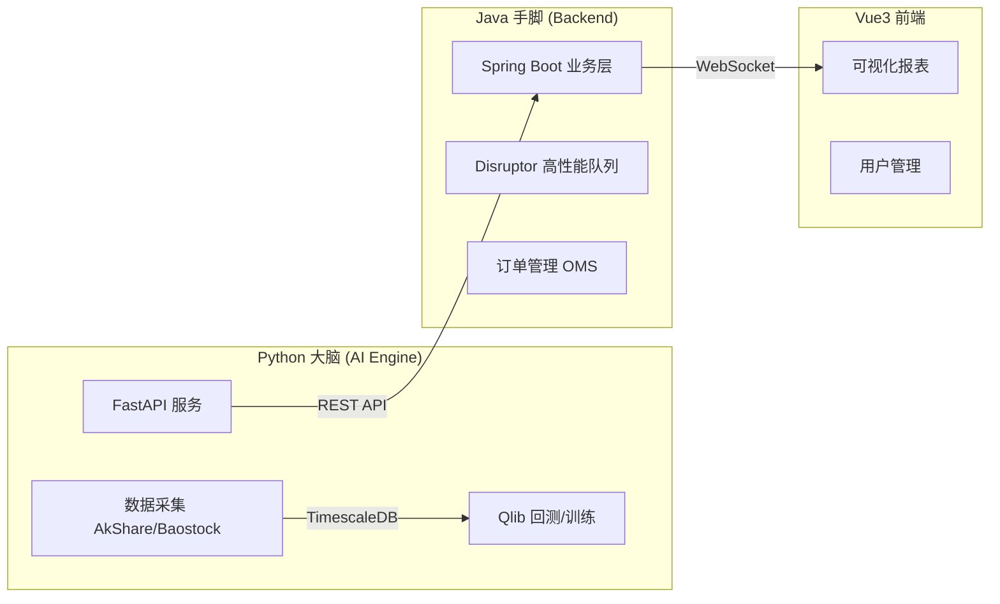
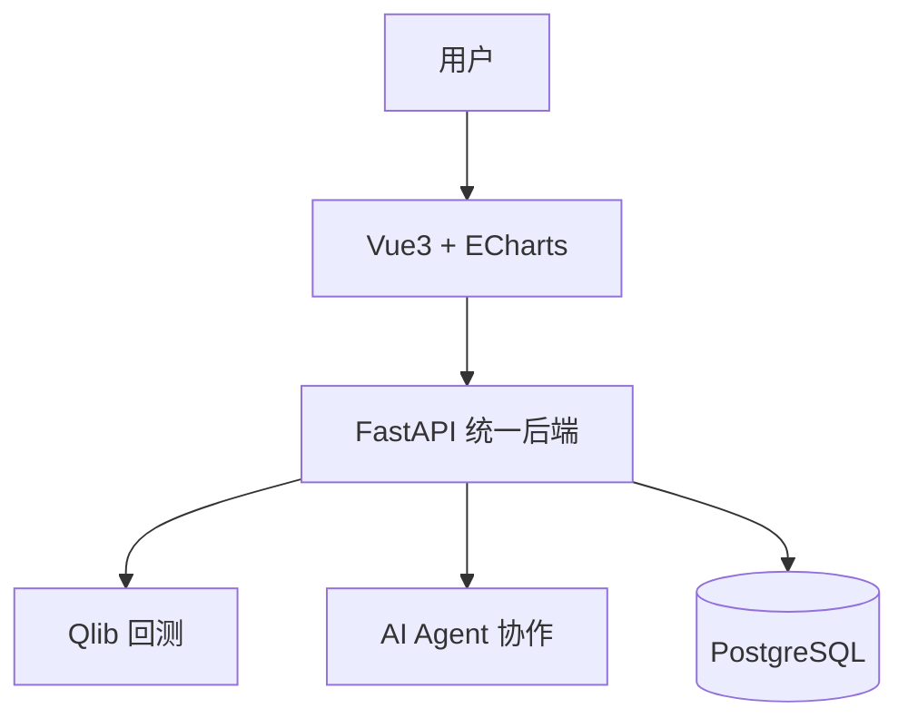
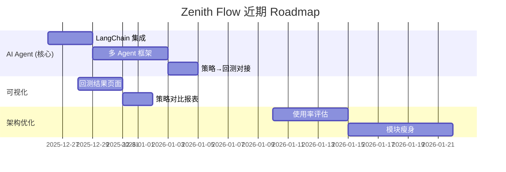

# Zenith Flow 架构合理性分析报告

**日期**: 2025-12-25  
**分析对象**: Python 训练 + Java 推理的混合架构  
**对比项目**: vnpy, Qlib, Backtrader

---

## 1. 当前架构概览



| 组件 | 技术栈 | 职责 |
|:---|:---|:---|
| **AI Engine** | Python + Qlib + FastAPI | 策略研发、模型训练、回测 |
| **Backend** | Java + Spring Boot + Disruptor | 用户管理、风控、实盘执行 |
| **Frontend** | Vue 3 + ECharts | 可视化、配置界面 |

---

## 2. 针对用户需求的架构评估

根据用户的核心需求：

> ❌ 不需要毫秒级实盘交易  
> ✅ 策略回测、AI 对接、多 Agent 讨论、可视化报表、用户管理

### 2.1 ✅ 架构优势

| 维度 | 评价 | 说明 |
|:---|:---|:---|
| **AI 生态兼容性** | ⭐⭐⭐⭐⭐ | Python 端天然支持 LangChain/AutoGen/Qlib，适合 AI Agent 协作场景 |
| **回测能力** | ⭐⭐⭐⭐⭐ | Qlib 提供完整的因子挖掘、模型训练、回测框架 |
| **可视化报表** | ⭐⭐⭐⭐⭐ | Vue3 + ECharts 可实现专业级报表，远超 vnpy 的 Qt 界面 |
| **多用户/SaaS** | ⭐⭐⭐⭐⭐ | Java Spring Security 提供成熟的权限体系 |
| **工程化** | ⭐⭐⭐⭐ | Poetry/Ruff/MyPy + Maven，代码质量可控 |

### 2.2 ⚠️ 架构过度设计的地方

> [!WARNING]
> **核心问题：Java 层对于纯回测+AI研投场景可能是"过度设计"**

| 过度设计点 | 原因 | 影响 |
|:---|:---|:---|
| **Disruptor 高性能队列** | 用于微秒级交易，但用户不需要实盘 HFT | 增加复杂度，维护成本 |
| **Java/Python 双语言微服务** | 需要维护两套代码、两套测试、跨语言调用 | 开发效率降低 |
| **Feign 远程调用** | 引入网络延迟和序列化开销 | 对回测性能无益 |

---

## 3. 与开源项目对比

### 3.1 vs vnpy

| 维度 | vnpy | Zenith Flow | 结论 |
|:---|:---|:---|:---|
| **语言** | 纯 Python | Python + Java | vnpy 更轻量 |
| **回测引擎** | 自研 CtaBacktester | Microsoft Qlib | **Qlib 更强** (因子/深度学习) |
| **实盘对接** | 完整 CTP/QMT 网关 | 待开发 | vnpy 更成熟 |
| **AI 集成** | 无原生支持 | FastAPI + 可扩展 LangChain | **ZF 更优** |
| **可视化** | Qt 桌面 | Web + ECharts | **ZF 更灵活** |
| **多用户** | 单用户 | 支持多租户 | **ZF 更适合 SaaS** |

> [!NOTE]
> **vnpy 的定位**是"开箱即用的实盘交易客户端"，而 **Zenith Flow** 的定位是"AI 投研 SaaS 平台"，两者目标不同。

### 3.2 vs Qlib (纯 Python)

如果只需要回测 + AI 研投，纯 Qlib + FastAPI 架构理论上足够：

```
Qlib + FastAPI + SQLite/PostgreSQL + Streamlit/Gradio
```

**Zenith Flow 相对于纯 Qlib 的额外价值**：
1. 结构化用户管理 (Spring Security)
2. 前端工程化 (Vue3 组件化)
3. 未来扩展实盘交易的能力保留

---

## 4. 针对用户场景的建议

### 场景重述

> 跑策略，回测结果，后续与 AI 对接，让 AI 间讨论近期行情，形成策略，回测，可视化报表，用户管理

### 4.1 ✅ 架构可行的部分

1. **保留 Python AI Engine**：这是核心价值所在
   - Qlib 回测逻辑 ✅
   - FastAPI 服务化 ✅
   - 未来接入 LangChain/AutoGen ✅

2. **保留 Vue3 前端**：提供专业可视化能力
   - ECharts 图表 ✅
   - 响应式设计 ✅

3. **保留 Java 用户管理层**：成熟的权限控制
   - Spring Security ✅
   - 多租户隔离 ✅

### 4.2 🔄 建议简化的部分

| 组件 | 当前状态 | 建议 |
|:---|:---|:---|
| **Disruptor** | 已集成 | 🔄 降级为可选模块，非核心路径 |
| **Java 量化逻辑** | `zenith-flow-quant` | 🔄 只保留调度和转发，核心计算留在 Python |
| **微服务拆分** | Feign 调用 | 🔄 可考虑合并为单体，降低运维复杂度 |

### 4.3 💡 替代架构方案 (更轻量)

如果从零开始，针对用户需求的最简架构：



单语言（Python）+ 前后端分离，即可满足需求。

---

## 5. 结论

### ✅ 当前架构是否合适？

**合适，但存在冗余。**

| 评分维度 | 评分 | 说明 |
|:---|:---|:---|
| **需求覆盖度** | 9/10 | 完全满足回测、AI、可视化、用户管理需求 |
| **架构简洁度** | 6/10 | Java 层对纯研投场景略显笨重 |
| **可维护性** | 7/10 | 双语言增加维护成本 |
| **可扩展性** | 9/10 | 保留了实盘扩展的能力 |

### 📋 最终建议

1. **短期 (当前)**：继续使用现有架构，专注于 Python 端 AI Agent 和回测能力
2. **中期**：评估 Java 层的实际使用率，如不需要实盘，可逐步迁移用户管理到 Python (FastAPI + JWT)
3. **长期**：若需实盘交易，再启用 Java 高性能模块

> [!TIP]
> **Python 训练 + Java 推理**的设计理念本身是合理的（参考 TensorFlow Serving、Triton Inference），但在您"不需要毫秒级实盘"的场景下，Java 端的高性能特性未被充分利用。建议以 Python 为主导，Java 作为可选增强。

---

## 6. 接下来的任务项 📋

> **基于架构分析 + 项目当前进度 (2025-12-25)**

### 🎯 短期任务 (1-2 周)

#### 阶段 1: AI Agent 能力建设 (核心价值)

| 任务 | 优先级 | 预估时间 | 说明 |
|:---|:---:|:---:|:---|
| **LangChain 集成 PoC** | 🔴 P0 | 2-3 天 | 在 Python AI Engine 中集成 LangChain，实现基础的 Agent 调用链 |
| **多 Agent 行情讨论框架** | 🔴 P0 | 3-5 天 | 设计多 Agent 协作架构，支持"AI 间讨论行情 → 形成策略"工作流 |
| **Agent 策略 → Qlib 回测对接** | 🟡 P1 | 2 天 | 将 Agent 生成的策略无缝传递给 Qlib 执行回测 |

#### 阶段 2: 可视化与报表增强

| 任务 | 优先级 | 预估时间 | 说明 |
|:---|:---:|:---:|:---|
| **回测结果可视化页面** | 🟡 P1 | 2-3 天 | ECharts 展示净值曲线、回撤、夏普率等核心指标 |
| **策略对比报表** | 🟢 P2 | 1-2 天 | 支持多策略横向对比 |
| **Agent 讨论过程可视化** | 🟢 P2 | 2 天 | 展示 AI Agent 的推理过程和讨论记录 |

---

### 🔄 中期任务 (1-2 个月)

#### 阶段 3: 架构简化评估

根据本报告 §4.2 的建议：

- [ ] **评估 Disruptor 使用率** - 若纯回测场景，降级为可选模块
- [ ] **Java 量化模块瘦身** - 保留调度转发，核心计算迁移至 Python
- [ ] **微服务合并评估** - 分析 Feign 调用频率，考虑单体化

#### 阶段 4: 实盘能力 (可选)

> [!NOTE]
> 仅在确认需要实盘交易时启动

- [ ] **QMT/XtQuant API 调研** - 评估模拟环境搭建 *(dev-log 中已列入计划)*
- [ ] **统一交易接口抽象** - 设计适配器模式，支持多券商
- [ ] **风控模块 MVP** - 最大回撤、单日亏损、仓位控制

---

### 📌 建议的执行顺序



> [!IMPORTANT]
> **首要聚焦**：AI Agent 能力是 Zenith Flow 区别于 vnpy 的核心竞争力，建议优先投入资源。
