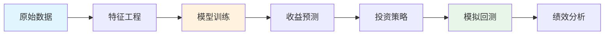

# Qlib 量化平台入门指南

> 面向量化新手的 Qlib 使用教程，从逻辑和代码两个维度帮助你理解量化投资的完整流程。

## 目录

1. [什么是 Qlib？](#什么是-qlib)
2. [量化投资的核心逻辑](#量化投资的核心逻辑)
3. [Qlib 工作流详解](#qlib-工作流详解)
4. [代码调用链分析](#代码调用链分析)
5. [实战示例](#实战示例)

---

## 什么是 Qlib？

**Qlib** 是微软开源的 AI 量化投资平台，它提供了一套完整的量化投资工具链：

```
┌─────────────────────────────────────────────────────────────────┐
│                         Qlib 生态系统                            │
├─────────────────────────────────────────────────────────────────┤
│  数据层     │  模型层      │  策略层      │  回测层              │
│  --------   │  --------    │  --------    │  --------            │
│  数据获取   │  机器学习    │  信号策略    │  模拟交易            │
│  特征工程   │  深度学习    │  组合优化    │  绩效分析            │
│  数据处理   │  模型训练    │  风险控制    │  归因分析            │
└─────────────────────────────────────────────────────────────────┘
```

### 为什么选择 Qlib？

| 特点 | 说明 |
|------|------|
| **端到端** | 从数据到回测的完整解决方案 |
| **AI 友好** | 内置多种机器学习/深度学习模型 |
| **可扩展** | 模块化设计，易于自定义 |
| **生产级** | 工业级代码质量，可用于实盘 |

---

## 量化投资的核心逻辑

量化投资的本质是用数据和模型来做投资决策。整个流程可以用一句话概括：

> **用历史数据训练模型，用模型预测未来收益，根据预测构建投资组合**

### 完整流程图



### 逻辑拆解

#### 1️⃣ 数据准备阶段

**目标**：将原始行情数据转化为模型可用的特征

```
原始数据 (价格、成交量...)
    ↓
特征工程 (技术指标、统计量...)
    ↓
数据集 (训练集、验证集、测试集)
```

**关键概念**：
- **Handler（数据处理器）**：负责特征计算和数据标准化
- **Dataset（数据集）**：管理数据分割和采样

#### 2️⃣ 模型训练阶段

**目标**：学习历史规律，预测未来收益

```
训练数据 + 标签（未来收益）
    ↓
模型学习（LightGBM / LSTM / ...）
    ↓
预测结果（每只股票的预期收益分数）
```

**关键概念**：
- **Model（模型）**：可以是传统机器学习（LGBModel）或深度学习（LSTM、ALSTM）
- **Signal（信号）**：模型的预测输出，表示股票的预期表现

#### 3️⃣ 策略执行阶段

**目标**：根据预测信号构建投资组合

```
预测信号（股票排名）
    ↓
策略决策（买入 Top 50，卖出表现差的）
    ↓
交易订单
```

**关键概念**：
- **Strategy（策略）**：如 `TopkDropoutStrategy` - 买入预测分数最高的 K 只股票
- **topk**：持仓股票数量
- **n_drop**：每次调仓时替换的股票数量

#### 4️⃣ 回测分析阶段

**目标**：验证策略在历史数据上的表现

```
策略 + 历史数据
    ↓
模拟交易（考虑手续费、滑点）
    ↓
绩效指标（收益率、夏普比率、最大回撤）
```

**关键概念**：
- **Backtest（回测）**：在历史数据上模拟策略执行
- **Executor（执行器）**：模拟交易执行，处理撮合逻辑

---

## Qlib 工作流详解

在本项目中，我们封装了完整的 Qlib 工作流。以下是核心组件：

### 架构图

```
┌─────────────────────────────────────────────────────────────────────────┐
│                           API Layer (FastAPI)                            │
│  /api/v1/train/qlib/start    /api/v1/backtest/qlib/start                │
└────────────────────────────────────────┬────────────────────────────────┘
                                         │
                                         ▼
┌─────────────────────────────────────────────────────────────────────────┐
│                     QlibWorkflowService                                  │
│  ┌─────────────────┐  ┌─────────────────┐  ┌─────────────────┐         │
│  │ train_model()   │  │ run_backtest() │  │ create_config() │         │
│  └────────┬────────┘  └────────┬────────┘  └─────────────────┘         │
└───────────┼──────────────────────┼──────────────────────────────────────┘
            │                      │
            │ subprocess           │
            ▼                      ▼
┌─────────────────────┐  ┌─────────────────────────────────────┐
│ qlib_train_worker   │  │           Qlib Core                  │
│ (独立进程)           │  │  - backtest()                        │
│ - DatasetH          │  │  - risk_analysis()                   │
│ - Model.fit()       │  │  - TopkDropoutStrategy               │
│ - R.save_objects()  │  └─────────────────────────────────────┘
└─────────────────────┘
```

### 为什么使用独立进程训练？

> [!NOTE]
> Windows 环境下，Qlib 的多线程机制与 FastAPI 的事件循环存在冲突。
> 使用 `subprocess` 在独立进程中执行训练，可以避免死锁和崩溃问题。

---

## 代码调用链分析

### 训练流程调用链

```python
# 1. API 入口
POST /api/v1/train/qlib/start
    │
    ▼
# 2. 服务层
QlibWorkflowService.train_model(experiment_name, market, model_type, ...)
    │
    ├── create_workflow_config()          # 生成配置
    │       │
    │       └── 配置结构:
    │           {
    │               "dataset": {
    │                   "handler": { Alpha158 配置 },
    │                   "segments": { train, valid, test 日期 }
    │               },
    │               "model": { LGBModel/LSTM/ALSTM 配置 }
    │           }
    │
    ├── yaml.dump(config, config_path)    # 保存配置文件
    │
    └── subprocess.run(qlib_train_worker.py, ...)   # 启动训练进程
            │
            ▼
# 3. Worker 进程
qlib_train_worker.run_train(config_path, experiment_name, ...)
    │
    ├── qlib.init(provider_uri, region)   # 初始化 Qlib
    │
    ├── R.start(experiment_name)          # 开始实验记录
    │       │
    │       └── 创建 MLflow Experiment
    │
    ├── handler = init_instance_by_config(handler_config)
    │       │
    │       └── Alpha158(instruments, start_time, end_time, ...)
    │               │
    │               └── 计算 158 个技术因子
    │
    ├── dataset = DatasetH(handler, segments)
    │       │
    │       └── 数据分割: train/valid/test
    │
    ├── model = LGBModel(**kwargs)        # 或 LSTM/ALSTM
    │
    ├── model.fit(dataset)                # 模型训练 ⭐
    │       │
    │       ├── 获取训练数据: dataset.prepare("train")
    │       ├── 获取验证数据: dataset.prepare("valid")
    │       └── LightGBM 训练循环
    │
    ├── pred = model.predict(dataset)     # 生成预测
    │       │
    │       └── 对 test 集生成预测分数
    │
    └── R.save_objects(pred.pkl)          # 保存预测结果
            │
            └── 保存到 MLflow Artifacts
```

### 回测流程调用链

```python
# 1. API 入口
POST /api/v1/backtest/qlib/start
    │
    ▼
# 2. 服务层
QlibWorkflowService.run_backtest(experiment_name, recorder_id, ...)
    │
    ├── qlib.init()                       # 初始化
    │
    ├── 加载预测结果
    │       ├── pred = pd.read_pickle(pred_path)     # 如提供路径
    │       └── pred = recorder.load_object("pred.pkl")  # 从 MLflow 加载
    │
    ├── strategy = TopkDropoutStrategy(signal=pred, topk=50, n_drop=5)
    │       │
    │       └── 策略配置:
    │           - 买入预测分数最高的 50 只股票
    │           - 每次调仓替换 5 只
    │
    ├── executor_config = { SimulatorExecutor 配置 }
    │
    └── backtest(start_time, end_time, strategy, executor, ...)  # ⭐
            │
            ├── get_strategy_executor()   # 初始化策略和执行器
            │       │
            │       ├── Exchange(...)     # 创建交易所模拟器
            │       │       └── 处理手续费、滑点、涨跌停
            │       │
            │       └── CommonInfrastructure(account, exchange)
            │
            └── backtest_loop(start_time, end_time, strategy, executor)
                    │
                    ├── 每日循环:
                    │       ├── strategy.generate_trade_decision()  # 生成交易决策
                    │       └── executor.execute()                  # 执行交易
                    │
                    └── 返回: (portfolio_metric, indicator_metric)
```

---

## 实战示例

### 最简化的训练+回测代码

```python
from zenith_ai.services.qlib_workflow_service import QlibWorkflowService

# 1. 创建服务实例
service = QlibWorkflowService()

# 2. 训练模型
train_result = service.train_model(
    experiment_name="my_first_experiment",  # 实验名称
    market="csi300",                        # 市场：沪深300
    model_type="LGBModel",                  # 模型：LightGBM
    start_date="2020-01-01",                # 数据起始日期
    end_date="2021-12-31"                   # 数据结束日期
)

print(f"训练状态: {train_result['status']}")
print(f"预测文件: {train_result['pred_path']}")

# 3. 运行回测
backtest_result = service.run_backtest(
    experiment_name="my_first_experiment",
    recorder_id=train_result['recorder_id'],
    pred_path=train_result['pred_path'],
    start_date="2022-01-01",                # 回测开始
    end_date="2022-06-30"                   # 回测结束
)

print(f"回测状态: {backtest_result['status']}")
```

### 支持的模型类型

| 模型 | 类名 | 特点 | 适用场景 |
|------|------|------|----------|
| **LGBModel** | LightGBM | 速度快，效果好 | 日常研究，快速验证 |
| **LSTM** | LSTM | 捕捉时序依赖 | 需要时间序列特征 |
| **ALSTM** | Attention LSTM | 注意力机制 | 长期依赖关系 |

### 关键参数说明

```python
# TopkDropoutStrategy 参数
strategy = TopkDropoutStrategy(
    signal=pred,      # 预测信号（DataFrame）
    topk=50,          # 持仓数量：买入分数最高的 50 只
    n_drop=5          # 每次替换 5 只表现最差的
)

# 回测参数
backtest_config = {
    "account": 1000000,           # 初始资金 100 万
    "benchmark": "SH000300",      # 基准：沪深300指数
    "exchange_kwargs": {
        "freq": "day",            # 交易频率：日频
        "open_cost": 0.0005,      # 买入手续费 0.05%
        "close_cost": 0.0015,     # 卖出手续费 0.15%（含印花税）
        "min_cost": 5,            # 最低手续费 5 元
        "limit_threshold": 0.095  # 涨跌停限制 9.5%
    }
}
```

---

## 常见问题

### Q1: 为什么训练很慢？

**A**: 检查数据范围和模型参数。建议先用短日期范围（如 1 个月）测试流程。

### Q2: 回测结果为负收益怎么办？

**A**: 这是正常的！量化策略需要反复调优。可以尝试：
- 调整 `topk` 和 `n_drop` 参数
- 更换模型类型
- 增加训练数据
- 优化特征工程

### Q3: 如何查看实验记录？

**A**: Qlib 使用 MLflow 记录实验，可以通过以下方式查看：

```python
from qlib.workflow import R

# 列出所有实验
experiments = R.list_experiments()

# 获取特定实验
exp = R.get_exp(experiment_name="my_experiment")
recorders = exp.list_recorders()
```

---

## 下一步学习

1. **深入 Alpha158**：了解 158 个因子的计算逻辑
2. **自定义策略**：继承 `BaseStrategy` 实现自己的策略
3. **因子挖掘**：使用 Qlib 的表达式引擎挖掘新因子
4. **组合优化**：学习 `EnhancedIndexingStrategy` 等高级策略

---

> 📚 更多内容请参考 [Qlib 官方文档](https://qlib.readthedocs.io/)
