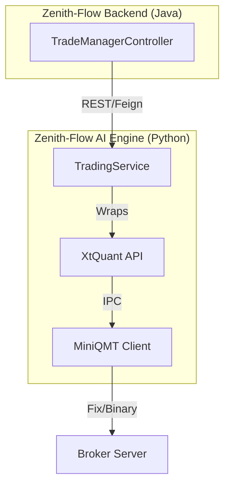

# Research: QMT/XtQuant API Integration

## Overview
XtQuant is the Python SDK for **MiniQMT** (迅投 QMT), a popular quantitative trading terminal in the Chinese A-share market. It allows local Python scripts to interact with a running MiniQMT client for market data and automated trading.

## Core Modules

### 1. `xtdata` (Market Data)
- **Purpose**: Fetch real-time and historical market data.
- **Key Functions**:
  - `get_market_data`: Fetch historical K-line data.
  - `subscribe_quote`: Subscribe to real-time tick/quote data.
  - `get_full_tick`: Get the latest tick data for a list of securities.
- **Connectivity**: Local IPC with MiniQMT (usually no separate login required for data).

### 2. `xttrade` (Trading)
- **Purpose**: Execute orders and manage accounts.
- **Key Functions**:
  - `order_stock`: Place a stock order (Buy/Sell).
  - `cancel_order`: Cancel an existing order.
  - `query_stock_asset`: Check account balance.
  - `query_stock_positions`: Check current holdings.
- **Callbacks**: Supports registered callbacks for order updates and fill notifications.

## Integration Strategy for Zenith-Flow

### Proposed Architecture

### 1. Unified Interface
Define a `BaseTradingService` in `zenith-flow-ai-engine` to abstract different brokers (QMT, IB, etc.).

### 2. Async Execution
Since trading operations (order placement, fill detection) are asynchronous, use the AI Engine's existing async task infrastructure (FastAPI background tasks or a dedicated scheduler).

### 3. State Management
The Java backend should remain the "source of truth" for order state, while the Python AI engine acts as the "Gateway" to the exchange.

## Next Steps
1.  **Scaffold**: Create `zenith_ai/services/trading_service.py`.
2.  **Dependencies**: Add `xtquant` to `poetry` dependencies (Note: `xtquant` might require manual installation or a specific repo as it's often distributed via券商).
3.  **Mocking**: Implement a `MockTradingService` for testing without the MiniQMT client.
